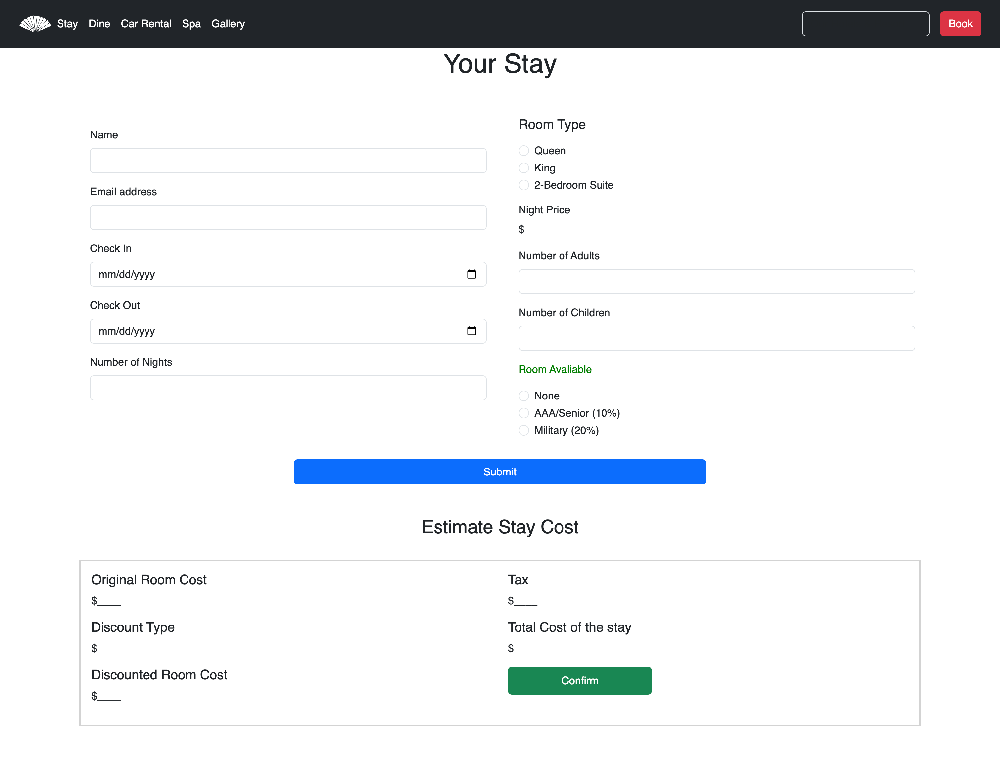

# Workshop - 2 Vacation Resort

#### Design inspired by mandarinoriental.com

### Home Page

A home page with informational text about the resort, images, and navigation links.

### Stay Page
This page allows a user to choose room in which they will stay.

### Book Page
This page allows a user to determine how much a hotel room will cost at the resort on a given day for a given room type.

- Price a stay using the in-season and out-of-season rates based on their check-in date. For
example, if someone checks in to a Queen room on 3/20 (March) the rate is $150/night, but if
they check in on 6/20 (June), the rate is $250/night.

### Dine Page

